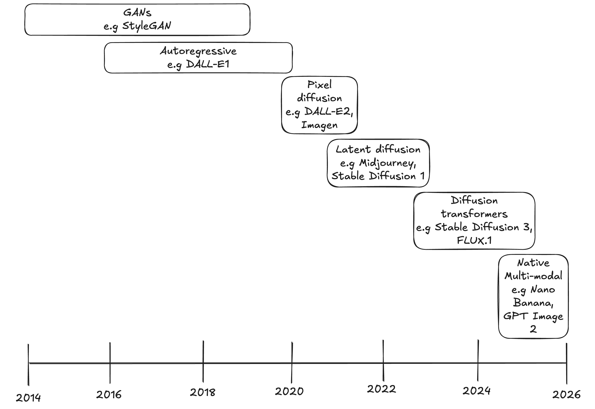

# Fake Image Detection: Research Notes

This project is a work in progress. 

This page documents the initial research process.

The process of building the dataset is documented in `notebooks/dataset_exploration.ipynb`.

The actual training process is initiated from `train.py`, which imports from python files in `fake_image_detection`.

## Table of Contents
- [Introduction](#introduction)
    - [Motivation](#motivation)
    - [Aims](#aims)
- [How are synthetic images generated?](#how-are-synthetic-images-generated)
- [How are synthetic images detected?](#how-are-synthetic-images-detected)
- [Literature Review](#literature-review)
    - [Summary](#summary)
- [Experiment Ideas](#experiment-ideas)
- [Dataset](#dataset)
    - [Synthetic Images](#synthetic-images)
    - [Real Images](#real-images)
    - [Image Augmentations](#image-augmentations)
    - [The effect of image quality on overfitting in synthetic image detection](#the-effect-of-image-quality-on-overfitting-in-synthetic-image-detection)
- [Choosing a pre-trained vision transformer](#choosing-a-pre-trained-vision-transformer)
    - [ViT trained on ImageNet](#vit-trained-on-image-net)
    - [ViT trained on CLIP](#vit-trained-on-clip)
    - [Patch Sizes](#patch-sizes)

## Introduction

### Motivation

The motivation for this research project comes from the increasing prevalence of AI-generated images in various aspects of everyday life and my concerns about the potential impacts of society being able to easily generate and share such content. To name just a few of these concerns:

- Online scams where the buyer relies on an image
- Fabricated political / high-profile events (and other types of misinformation)
- Non-consensual intimate imagery

### Aims

The technology used to generate images, video, audio etc is advancing faster than our ability to reliably detect synthetic content. As the European Parliament notes in their 2025 briefing on 'Children and deepfakes': '*no single robust solution currently exists to detect and reduce the spread of harmful AI-generated content.*'[^eu-parliament]

I'd like to learn more about how synthetic images are generated and how we can detect them. 

Once I have an understanding of the current state of research in this area, I plan to run experiments of my own. Given time and computational resource constraints, my aim won't be to produce the best model possible, but rather to see what can be achieved by fine-tuning models on ~1000s of images.

Given enough time I'd be interested in using techniques such as class activation map methods to visualise image artifacts that models learn in order to distinguish real from synthetic. 

## How are synthetic images generated?

The main architectures and methods are outlined in this section.

#### Autoregressive
- This is a method which treats images as a sequence of pixels or tokens, and predicts them one at a time based on the previous ones. The underlying architecture can be convolutional or transformer-based.
- This was found to be very slow when operating at the pixel-level, but was improved by encoding each image patch as a token from a vocabulary of visual patterns
- An example of an autoregressive image generation model is DALL-E1, released in 2021. This has a transformer architecture which predicts the image tokens then passes them to a VQ-VAE decoder to produce pixels. We won't explore the details of the architecture here, but the following blog posts explain them very well: [^dalle1-1][^dalle1-2].
- Ultimately autoregressive models were overtaken by diffusion models, which are more efficient and better at rendering the image. For example DALL-E1's successor DALL-E2 replaced autoregressive image generation with diffusion. However, we'll see at the end of this section that autoregression has made a come back in image generation with the use of LLMs.

#### Autoencoders
- This is a model architecture consisting of an encoder and a decoder.
- An encoder embeds the image; a decoder reconstructs the image from the embedding. These are convolutional neural networks.
- Face swapping can be achieved by exchanging the encoded features between different images
- *Variational* autoencoders (VAEs) are a distinct type of autoencoder. While a basic autoencoder encodes an image to the same set of features every time (i.e it's deterministic), a variational autoencoder encodes a probaility distribution for each feature. Regularisation smooths this latent space, therefore by sampling from it they can generate new data similar to the original training data. 
- While autoencoders were never widely used as images generators due to them generating blurry images, they became an important component in latent diffusion models and many native multi-modal LLMs.

#### GANs
- This architecture consists of a generator network that creates synthetic content, alongside a discriminator which tries to distinguish real vs synthetic. The two networks are trained in an adversarial process.
- Early GANs consisted of fully-connected layers, while later GANs such as ProGAN and StyleGAN consist of convolutional layers.
- Commonly used for face synthesis, e.g StyleGAN. Also used for face morphing, e.g for generating synthetic identities
- Can be used to synchronise lip movements with audio in videos, e.g Wav2Lip

#### Diffusion models
- Diffusion is a method in which noise is iteratively added to an image and a model predicts the added noise. At inference time this process is reversed to produce an image from noise, conditioned on a text prompt.
- The original diffusion models used for image generation had U-Net architectures. Like autoencoders, these are convolutional neural networks consisting of an encoder and decoder, however the output of a U-Net is not the same as the input. The U-Net was designed for image segmentation, i.e outputting a 'mask' the same size as the input image but with each pixel labelled with its class. Instead of a mask, diffusion U-Nets output noise in the same size as the input noisy image, so that it can be subtracted from the input.
- When the noise is added to image *pixels*, this is called *pixel* diffusion.
- *Latent* diffusion, as used by the StableDiffusion & FLUX models, actually involves VAEs. A VAE is pre-trained on real images, then the diffusion process runs in the VAE's *latent* space, as this is less computationally expensive than running diffusion in higher-dimensional pixel space (as in *pixel* diffusion).
    - Most open-source models are *latent* diffusion models as they are relatively cheap to train and run.
- Diffusion *transformers* replace the traditional U-Net architecture of diffusion models with a transformer. The latent (i.e the compressed image) is split into patches and processed by a transformer. The main advantage over the U-Net architecture is better scalability[^iclr-blog], i.e greater performance gain as more parameters are added. The diffusion transformer architecture is used in the FLUX and SD3 models.

Before we move on to multi-modal LLMs, we should briefly discuss text conditioning. 

#### Text Conditioning

We've discussed how images can be generated, but not how we can specify the content of the image.

Separate from the image generation model, we need a text encoder; CLIP[^clip] is commonly used here. CLIP consists of an image encoder and text encoder, both trained to map images and their corresponding text description close to one another in a shared embedding space. Therefore, to condition image generation on text we take CLIP's text encoder and use it to embed a text prompt. Diffusion models have cross-attention layers in which image regions attend to text tokens so that each region draws on the words most relevant to it. But how do we get these image tokens? In a DiT the input noise latent is split into patches which are then embedded. We've mentioned that U-Nets consist of convolutional layers, but a key detail is that they also contain attention blocks which tokenise (flatten) the feature maps output by the convolutional layers.

Some models such as Stable Diffusion 3 use self-attention rather than cross-attention since they first concatenate image and text tokens into a single sequence; these are called multi-modal diffusion transformers (MMDiT). Note that text-conditioned image generation was possible before the attention mechanism was invented; text was embedded into a vector, but there was no way for a given image region to know what part of the text prompt was relevant.

Multi-modal diffusion transformers are a good link to the next section on multi-modal LLMs. Like MMDiTs, multi-modal LLMs operate on combined text-image token sequences, so in theory an MMDiT and LLM can be combined.

#### Multi-modal LLMs 
- While older image generation models consisted of a text encoder attached to a diffusion model, native multi-modal LLMs can predict the next image token in the same sequence as text.
- While the exact architecture of multi-modal-LLM-based image generation models varies a lot between companies, it's important to note that they often still involve a diffusion component. This component renders an image from the latent output by the LLM. The LLM draws on its knowledge and skills (e.g reasoning) to produce image latents that more closely match the text prompt; this is why this architecture has shown an improvement in generating images containing text.

There isn't a definitive source for which synthetic-image-generation models are the *best* at the moment. However, the top rankings of the Arena text-to-image leaderboard[^arena-leaderboard] include the following (as of 3rd August 2026):

- GPT Image 2 
- Reve 2.1 
- Google Nano Banana 2

Google's Nano Banana and GPT Image 2 are examples of multi-modal LLMs. As well as generating new images, they make editing images very easy, for example adding a generated object to a real image. The exact architecures of these examples are not published. Reve combines an LLM backbone for 'planning' and a diffusion component for 'rendering'. The Reve website[^reve] states: "*Diffusion models generate beautiful images, but they're not very intelligent or scalable. Autoregressive models (LLMs) are extremely intelligent, but...latency makes creative iteration painfully slow. Reve 2.1 leverages the best of both worlds by separating planning from rendering.*" Reve also claims to mitigate degradation caused by the accumulation of diffusion and compression artifacts which result from iterative editing. They don't explain how, but they claim "*no accumulation of artifacts whatsoever*".

For many of the entries in the leaderboard, details about the model architecture haven't been released publicly. Even if we had this information, we wouldn't be able to conclusively say whether natively multi-modal LLMs outperform other architectures due to there being too many other factors that differ in how these models are trained, e.g the amount of data and compute available to the company. It's also worth noting that the number of votes and width of confidence intervals can vary a lot on the arena leaderboard.

#### Summary: How have image-generation model architectures evolved?

 

The adversarial nature of GANs can make training unstable and lead to 'collapse'. We won't go into detail about this, but the key thing to note is that diffusion models don't suffer from the same issues. As a result, diffusion models are easier to train and can generate more diverse images. So, while GANs were state-of-the-art for a while before 2020, they were largely replaced by diffusion models.

Within the category of diffusion models, we've moved from pixel diffusion to latent diffusion to diffusion transformers (and MMDiT). As mentioned, diffusion transformers are more scalable than the original U-Net diffusion architecture.

Currently, diffusion models are arguably state-of-the-art for pixel rendering, but where a simple text encoder was once used, now the reasoning skills and knowledge of multi-modal LLMs are harnessed to produce the image latents which get rendered.

https://iclr-blogposts.github.io/2026/blog/2026/diffusion-architecture-evolution/

In a 2026 ICLR blogpost, Chen et al 

provide an interactive timeline of models and their type (e.g non-text conditioned, U-Net text-to-image or DiT text-to-image). They also created a 'model architecture explorer' which enables selection of a Hugging Face diffusion model and displays 

## How are synthetic images detected?

Purpose: understand key techniques, their pros & cons and how well we can currently detect images generated by state-of-the-art models. I want to get an overview of the existing research, how different methods perform, important considerations such as amount of data, augmentations, training processes, explainability methods. This will inform my own research questions that I will explore later on.

#### Traditional techniques
- digital "forensics", e.g looking at patterns in noise
- modern generators don't leave behind the artifacts that these techniques rely on

#### CNNs
- Notably, the 2020 Wang et al paper (see [^detect-paper1]) found that systematic flaws in CNN-generated images could be detected by a CNN classifier.
- CNNs remain competitive as synthetic image detectors  
    - any evidence of them being used to detect current SOTA fake images?

#### Frequency / spectral methods
- See [^detect-paper10], which detects spectral artifacts created by GANs
- Diffusion models leave weaker spectral artifacts than GANs, so this method is less effective at detecting diffusion-generated images.
- Since U-Net diffusion involves convolutional layers, this generation method leaves checkerboard & spectral traces which can be detected by frequency methods

#### Transformers
- E.g fine-tuned vision transformer classifiers
- Some studies have found that transformers outperform CNNs on this task, which may be due to their ability to learn global features which are more likely to survive image transformations than the local features that CNNs learn.

#### Reconstruction-based?
- Exploits artifacts left by VAEs? Since diffusion runs in the latent space of a VAE, this method can detect diffusion-generated images?
    - Didn't work on images generated using pixel-space diffusion as these architectures don't involve VAEs
- e.g AEROBLADE

#### Autoencoders
- An image is passed through the autoencoder of a latent diffusion model ???

#### Multi-modal LLMs (MLLMs)
- Detects semantic signals like impossible geometry, lighting inconsistencies (e.g between a subject and the background) etc, however these inconsistencies are becoming less common as generation methods improve

### NEW

####  Spatial artifacts

- Spatial artifacts are irregularities in the image pixels, for example colour inconsistencies, texture irregularities and repeating patterns.
- GANs produce spatial artifacts due to their upsampling process; in particular, they can leave "periodic checkerboard patterns" (Odena et al[^odena-GAN-checkerboard] explain this well).
- In 2020 Liu et al observed that "the texture of fake faces [generated by GANs] is substantially different from real ones"[^gan-texture]. They used CAM methods to explore which regions CNNs pick up on in fake images; these were found to be "texture regions, e.g skin and hair". Bias towards recognising textures (as opposed to shapes) was also observed in CNNs by Wichmann et al[^cnn-texture], although this study evaluated CNNs pre-trained on ImageNet, and fake images were not involved.

So, GANs -- specifically later GANs with convolutional layers (e.g StyleGAN & ProGAN) -- produce artifacts as a result of convolutional upsampling, and these can be detected by CNNs due to their focus on local features.

Corvi et al[^corvi] found similar (but weaker) artifacts in images produced by diffusion models. This could also be explained by upsampling; both U-Net diffusion models and diffusion transformers have a convolutional upsampling process. Corvi et al conducted a study around the time diffusion models were overtaking GANs. As well as investigating the "forensic traces left by diffusion models", they looked at "how current detectors, developed for GAN-generated images, perform on these new synthetic images, especially in challenging social-network scenarios involving image compression and resizing". They found that detectors trained on GAN images perform poorly on diffusion-generated images, which is perhaps due to the difference in the model-specific artifacts that detectors rely on.

This study highlights 2 important ideas that we'll discuss in more detail later: the first is how new generation methods leave detectors trained on older generators redundant (lack of generalisability of detectors), and the second is the challenge of image transformations in the real-world (e.g on social media).

? But why do GAN-generated images have different textures from real images?

In addition to textural differences between real images and those generated by GANs, the latter can suffer from upsampling artifacts. That is, the upsampling process in GANs can leave periodic "checkerboard patterns" which can be detected with Fourier analysis

? As part of this study[^gan-texture] they trained a novel architecture called "Gram-Net", which consists of a CNN backbone with "Gram layers" which compute global texture representations, in order to address the issue of limited receptive field in CNNs. 

- This is a group of methods that detect "spatial patterns such as texture irregularities, unnatural edge formations and colour inconsistencies"[^detection-methods-review-1]
- CNNs can be used to detect these features. Other techniques include statistical analysis of pixel intensity distributions

An important study in this space was conducted in 2020 by Wang et al. In their paper "CNN-generated images are surprisingly easy to spot... for now"[^detect-paper1], they trained a CNN classifier (ResNet50) on images generated by ProGAN. The model was found to generalise 'suprisingly well' to images generated by other CNN-based image generated models such as StyleGAN. They concluded that CNN-generated images share common artifacts which enable detectors to generalise across different CNN-based architectures. A key feature of this study which we'll see across the detection section is the use of data augmentation. Wang et al applied various augmentations including gaussian blur and JPEG compression. The importance of data augmentation will be discussed later.

In 2023 Baraheem et al[^detect-paper2] fine-tuned CNN classifiers (e.g EfficientNetB4) on a dataset of 48,000 images generated by 12 different GANs. They explored model explainability using 4 different CAM techniques including GradCAM.

These two examples reflect a period of time in the research which can be summarised as "using CNNs to detect images generated by CNN-based models (e.g GANs)". More details on this period can be found in the 2020 "Media Forensics and DeepFakes: an overview" by Verdoliva[^verdoliva]

As diffusion models took over in the image generation space, the next question is how can we detect diffusion-generated images?

In 2023 Wang et al[^DIRE]

### Timeline

Mahara & Rishe provide more details on detection methods in "Methods and Trends in Detecting AI-Generated Images: A Comprehensive Review"[^detection-methods-review-1].

Like with generation models, detection models have transitioned from convolution-based to transformer-based architectures.

Detection methods that rely on generator-specific fingerprints become outdated. Those that can detect properties of real images, or semantic inconsistencies are more promising.

Most current state-of-the-art image generation models, e.g those with VLM components, still use diffusion to render the image. Reconstruction-based

#### Watermarking & C2PA

Some model providers such as Google add invisible watermarks to their images to enable end-users to identify the image as AI-generated (only certain models / platforms such as Google's Gemini can detect the watermark). While Google's SynthID watermark was designed to be robust to image transformations / manipulations such as compression and filtering, there is some evidence that the watermark can be removed.

C2PA is another approach to labelling AI-generated content. It uses cryptographically-signed metadata to provide secure & verifiable records of a media file's origin and changes. Currently, C2PA metadata gets stripped when downloading an image from a social media site or simply taking a screenshot of an image.

In August 2026 the EU AI Act will mandate that AI-generated image, audio and text must be tagged as AI-generated, using both a machine-readable watermark and a human-readable label.

## Literature Review

While the most recent research is of interest, I have also sourced some older papers (2023) in order to understand how research has progressed over the past few years. Another purpose of this literature review is to source data that I can use in my own experiments.

#### Paper 3: CIFAKE: Image Classification and Explainable Identification of AI-Generated Synthetic Images[^detect-paper3] (Jan 2024)
- Introduces the CIFAKE dataset: synthetic equivalents of CIFAR-10 generated using stable diffusion
- Trains a CNN for classifying real vs AI-generated images
- Implements Grad CAM to highlight regions influencing the model's decisions. These heatmaps reveal that the model focuses on subtle imperfections, often in the background, to distinguish real vs synthetic
 
In my opinion the images in the CIFAKE dataset look clearly AI-generated, which is unsuprising given that this paper is a couple of years old and diffusion models have surpassed GANs as state-of-the-art.

#### Paper 4: Towards universal fake image detectors that generalize across generative models[^UniversalFakeDetect-paper] ('UniversalFakeDetect') (April 2024)
- Highlighted that existing fake image detectors struggle to generalise to images from different generative models when trained on GAN-generated images
- To address this, the authors propose constructing a feature space using CLIP:ViT, e.g using nearest neighbour search to classify real vs fake

#### Paper 5: AI-Generated Image Detection: An Empirical Study and Future Research Directions[^detect-paper5] (Nov 2025)

Highlights the following issues across AI-generated image detection research:
- The limitations of forensic methods
- The use of non-standardised benchmarks with GAN- or diffusion-generated images
- Inconsistent training protocols
- Limited evaluation metrics that fail to capture generalisation & explainability

#### Paper 6: FakeXplained dataset[^detect-paper6] (June 2025)
- '*we aim to train MLLMs not only to detect AI-generated images but also to articulate why they are fake in a reliable and human-understandable manner. This necessitates a dataset that supports both visual grounding and textual reasoning.*'
- Produced ~9000 AI-generated images annotated with bounding boxes & descriptive captions highlighting synthesis artifacts

#### Paper 7: ThinkFake: Reasoning in Multimodal LLMs for AI-generated Image Detection[^detect-paper7]
- Highlights that directly prompting MLLMs (e.g '*explain what the artifacts are*') to generate textual explanations often results in hallucinations or overthinking, leading to inaccuracte outcomes or refusal to respond
- Researchers are employing fine-tuning approaches such as LoRA or DPO to overcome these limitations; these methods tend to memorise training patterns, which is then addressed using GRPO to enhance the model's ability to 'think'

#### Paper 8: Towards Explainable Fake Image Detection with Multi-Modal Large Language Models[^detect-paper8] (Nov 2025)
- Designed 6 specialised prompts, each targeting a distinct visual or logical aspect of an image. A majority vote is taken from across the 6 results to provide the classification.
- Created a dataset of 2000 images produced by various methods including diffusion & GAN
- Benchmarked 4 major multi-modal LLMs against other detectors

In this study I found it interesting that the models generally rejected (i.e refused to provide a response for) fewer images when the word `fake` in the prompt was replaced with `generated`. This highlights the sensitivity of LLMs to the precise wording of the prompt and the potential unreliability that results from this combined with the fact that explainability can be impacted by hallucinations (which is also highlighted in [^detect-paper7]).

The [^detect-paper8] paper highlights the same issues, but attempts to address them in different ways. Like FakeExplained, the [^aigi-holmes-dataset] also labels images with bounding boxes and descriptions. Unfortunately, due to the lack of standardised benchmarks (as highlighted [^detect-paper-5]), the performance of these approaches can't be compared side-by-side.

This study frames the limitations of MLLMs in a broader context: '*while MLLMs show promise in detecting AI-generated images, challenges remain in interpretability and alignment with human perception*...*ethically, ensuring transparency and accountability in detection models is critical, especially in sensitive areas like forensics and law enforcement.*'

### NEW

- CAN MULTI-MODAL (REASONING) LLMS WORK AS DEEPFAKE DETECTORS? (2025) https://arxiv.org/pdf/2503.20084
- A Timely Survey on Vision Transformer for Deepfake Detection (2024) https://arxiv.org/abs/2405.08463

- Community Forensics: Using Thousands of Generators to Train Fake Image Detectors (2025) [^community-forensics-paper]
    - "One of the key challenges of detecting AI-generated images is spotting images that have been created by previously unseen generative models"
    - collected 2.7 million images from 4803 different models
        - 774K images from diffusion models & GANs
        - 15K images from 'SOTA' model with unknown architectures, e.g DALL-E2, Midjourney V5, FLUX.1-dev & Imagen 3
    - study generalisation abilities of fake image detectors
    - dataset[^community-forensics-dataset]
        

### Summary
- Over the past few years, AI-generated image detection techniques have evolved from fine-tuning CNNs, to transformers and more recently, multi-modal LLMs.
- Data was initially generated using GANs, but  diffusion models have become increasingly popular (I haven't yet explored the details of why this is)
- CAM-based explainability techniques are often employed to identify areas of the image that the model focuses on / detects artifacts in
- MLLMs, with their reasoning abilities, show some promise, but also present new challenges such as hallucinations

## Research Questions

(This section could replace 'experiment ideas').

For a given dataset:
- How does an out-of-the-box pre-trained model (ViT / VLM) compare to one that has been fine-tuned on AI-generated images?
    - This paper[^out-of-box-detection] explores the same question (for multiple detectors)
- Could do a similar thing with VLMs: compare performance of a VLM (out-of-the-box) vs a fine-tuned VLM. Compare both results to those of the ViTs. Explore explainability.
    - Break down results by generator; [^out-of-box-detection] found that all detectors performed worse on SOTA commercial generators e.g Flux Dev & Midjourney v7

ViT fine-tuned with LoRA vs VLM (prompted) vs small VLM fine-tuned with LoRA.
- Here the research question is "How does the performance of a ViT compare to that of a VLM (out-of-the-box), and does fine-tuning the VLM improve its performance?". With a single ViT, single VLM and limited data and compute, I won't be able to say much about how the 2 model architectures perform at the task more generally.
- One hypothesis is that the ViT detects fake images based on low-level artifacts (e.g upsampling patterns, texture statistics), whereas the VLM reasons semantically (e.g it detects implausible anatomy, incoherent text, inconsistent lighting). Since LLM-based image generators are now better at producing images with coherent text and more semantically-sensible features than older models, will VLMs be able to detect them? Do they contain any of the low-level artifacts that ViTs can detect?
- For explainability, I can ask the VLM to explain its reasoning and/or provide some pre-defined categories of things it might detect e.g implausible anatomy, incoherent text, inconsistent lighting. However I should caveat that this doesn't necessary accurately reflect the VLM's actual reasoning! As for the ViT, I'd like to explore explainability methods such as GRAD-CAM. In both cases I should highlight that the work is exploratory and not proof of the mechanism by which each model distinguishes real from fake.
- I could also explore detection methods such as an out-of-the-box vision transformer pre-trained on real & fake images, or a linear probe (as a simple baseline). In the interest of time, these will most likely be left as future work.
- For fine-tuning, I'll most likely stick to LoRA for both the ViT and the VLM. However the PEFT method is a variable that I could potentially vary in future work.

## Experiment Ideas

This research has given me some ideas to build upon my original plan of fine-tuning a model to classify real vs synthetic images. 

My initial focus will be on fine-tuning a vision transformer. I like the idea implemented in [^UniversalFakeDetect-paper]: training on GAN-generated images and testing on diffusion-generated images in order to test the model's ability to generalise to images from a different model type. 

Beyond this, I'd be interested to compare my model's performance to that of an MLLM, experimenting with prompt engineering techniques and potentially fine-tuning.

Whether any of this is feasible depends on what data I can source. The next section will explore what suitable real & AI-generated data is publicly available.

## Dataset

### Synthetic Images

My research into synthetic datasets is summarised in the table below. Note that I looked specifically for GAN-generated and diffusion-generated images.

| Dataset Name | Model Type | Year of creation | Good enough quality to use? | Num real | Description of real images | Num synthetic | Description of synthetic images | Licence |
|-----|-----|-----|-----|-----|----------|-----|----------|-------|
| diffusion_datasets[^diffusion-datasets] | Diffusion | 2020 | No | 1000 | imagenet | 9000 | 1000 images from 9 different models | MIT (no restrictions)
| progan[^diffusion-datasets] | GAN | 2020 | No | 4200 | 21 classes (objects & animals); 201 of each | 4200 | 21 classes (objects and animals); 201 of each | MIT (no restrictions) |
| dragon_train_xs[^dragon-dataset] | Diffusion | 2024 - 2025 | Maybe | 0 | | 250 |  25 different models; only 10 images from each (same 10 prompts given to each model, so images are very similar) | Creative commons (fine for commercial & private use) |
| AIS-4SD[^AIS-4SD] | Diffusion | 2025 | Only 500 faces are usable (StableDiffusion-3-faces-20250203-1545) | 0 | | 4000 | 4 different models; 1000 images from each. 500 of people & 500 of other generic things | MIT |
| SFHQ-T2I[^SFHQ-T2I] | Diffusion | 2023 / 2024 | Yes | 0 | | 1700 |  All human faces. Produced by 2 different models. | MIT |
| SFHQ_part1[^SFHQ-part1] | GAN | 2022 / 2023 | Yes | 0 | | 550 | All human faces | Creative commons |
| CocoGlide[^CocoGlide] | Diffusion | 2022 | Maybe | 512 | | 512 | The synthetic images are very similar to the real ones - model just used for in-painting, not generation | Can’t find the original source! |

From across AIS-4SD & SFHQ-T2I we have 2200 diffusion-generated images of human faces, so I'm restricted to focusing my experiments on human faces. Unfortunately the real images I’ve found so far are not of human faces, so I need to look for some of these. 

One thing I need to look into is the dataset sizes that researchers have used in similar experiments. Given how difficult it's been to find the data summarised in the table, we'll initially use the ~2000 diffusion-generated images and look for 2000 real images of human faces to use alongside them.

I could of course generate my own dataset; I will consider this in future work, but in the interest of time and resources I will use publicly avaiable data for now.

Another idea for future work is to evaluate performance on test sets from different models, .eg
- Baseline diffusion-generated images similar to the training data (human faces)
- Diffusion-generated images that are not faces
- GAN-generated images: we have 550 human faces from SFHQ_part1

#### Images generated by SOTA models

- https://microsoft.github.io/MNW/
    - ~70,000 images produced by over 200 different generators
    - cannot be used for training, only evaluation
- NITRE 2026: https://huggingface.co/datasets/deepfakesMSU/NTIRE-RobustAIGenDetection-train/tree/main
    - ~1000 real & ~200,000 AI-generated across 20 generators
    - check licence!

### Real Images

| Dataset Name | Year of creation | Good enough to use? | Num real | Description | Licence |
| ----- | ----- | ----- | ----- | ----- | ----- |
| celeba | 2018 | No | 200,000 | Poor quality | N/A |
| FFHQ | 2022 | Yes | 3000 | Produced by NVIDIA as part of the original StyleGAN paper | Creative commons: You can use, redistribute, and adapt it for non-commercial purposes, as long as you (a) give appropriate credit by citing our paper, (b) indicate any changes that you've made, and (c) distribute any derivative works under the same license. |

### Image Augmentations

This paper[^french-gov-paper] from the French government focuses on the use of AI-generated content on social media, and the difficulty of detecting it. They apply transformations such as JPEG compression, addition of text, aesthetic filters and resizing, with the aim of imitating the progressive alteration of images as they are shared across social media. They highlight that manipulating synthetic images in ways such as these degrade the images and mask flaws related to their generation, *‘making it easier to deceive users and also impairing the capabilities of detection systems.’*

Image augmentations are especially important to prevent patterns in image quality, composition etc - which differ between the real & synthetic datasets - being learned by the model. With the datasets I’m using, composition is something I’m concerned about because the real images are cropped quite close to the faces, and they tend to look head-on at the camera, whereas in the synthetic images the pose varies more and the position of and amount of background around the person varies. Therefore we should consider:
- Applying random crops to both sets of images
- To crop the synthetic images closer to the faces, perhaps we could use a face detection model to get a bounding box around the face and crop slightly outside of this?
- Rotate the images

To account for differences in the quality of the real & synthetic images, I will consider the following types of augmentations:
- Adding blur / noise / jpeg compression to the diffusion-generated images to make the look lower quality (i.e more similar to the real images)
- Vary image resolution

There’s a huge amount of exploration I *could* do into the diversity of the real vs synthetic datasets in order to identify things that the model could learn to detect as a proxy for real vs synthetic. For example, skin tone, lighting, accessories such as glasses or hats, background (e.g inside vs outside), hair colour etc. We should apply transformations that vary these features as much as possible. Since we can't realistically account for all of these, we must acknowledge them as potential limitations in the model’s ability to learn features that actually distinguish real vs synthetic.

### The effect of image quality on overfitting in synthetic image detection
 
I did some research into the effect of image quality on overfitting in synthetic image detection.

#### Paper 9: A New Approach to Improve Learning-based Deepfake Detection[^detect-paper9] (March 2022)
- Addresses models overfitting to quality differences rather than semantic features.
- '*Training with augmentations on the same dataset remarkably improves performance on nearly all kinds of processed data even with intense severity, including JPEG compression, Gaussian noise, Gaussian blur, and Gamma correction*'

#### Paper 10: Any-Resolution AI-Generated Image Detection by Spectral Learning[^detect-paper10] (March 2025)
- Performance drops in all cases when augmentations are removed, highlighting their value. 

#### Paper 11: Fake or JPEG? Revealing Common Biases in Generated Image Detection Datasets[^detect-paper-11] (Sept 2025)
- '*Strong biases exist in existing benchmarks toward JPEG compression (real images: compressed, fake images: uncompressed). Many detectors inadvertently learn to detect JPEG artifacts rather than generation artifacts*'.

#### Paper 12: Generalized Design Choices for Deepfake Detectors[^detect-paper12] (Nov 2025)
- '*While data augmentation is critical for robust detection, excessively strong augmentations may be counterproductive; augmentations that closely mimic realistic post-processing operations encountered in-the-wild provide more consistent improvements*'
- Found that introducing repeated JPEG compression passes during training improves generalization capabilities

In summary, the research validates my concerns about image quality and strongly recommends applying augmentations such as JPEG compression.

## Choosing a pre-trained vision transformer

Most open-source ViTs were pre-trained on ImageNet or CLIP. There is also the Laion dataset, which was used to train stable diffusion among other text-to-image models. It comes in 2 versions: one trained on 400 million images and the other trained on 5 billion.

### ViT trained on ImageNet
- The original release of ImageNet contained 3 ‘people’ categories[^image-net]: scuba diver, bridegroom & baseball player, out of a total of 1000 categories. Other categories may contain people, but they are not the main subject of the image.
- In 2019, for privacy reasons all human faces in ImageNet were blurred

### ViT trained on CLIP
- While OpenAI has never explicitly specified or shared the data used to train the original CLIP model, the CLIP paper mentions that the model was trained on 400 million image-text pairs collected from the Internet[^clip-training-data].
- Presumably this data contained some human faces
- Given that the faces in ImageNet were blurred but those used to train CLIP were not, perhaps CLIP is a better choice. Comparing the performance of the two is another experiment we could do, but to start with let’s use CLIP.
- We can look on hugging face for open-source vision transformers that have been pre-trained on CLIP
- Another choice to make is patch size

### Patch sizes
- The standard patch size for vision transformers is 16 x 16
- Smaller patch sizes suit tasks that involve detecting small objects or high-resolution details, however their use also reduces computational efficiency. We'll start with a patch size of 16 x 16 and review whether there are any issues with computational efficiency.
- Image resolution should be divisible by patch size!

Next, see `notebooks/dataset_exploration.ipynb`, which documents building the dataset.

### Future Ideas
- does balancing the classes improve performance
    - stratified sampling
- K-fold cross-validation? Since we don't have a huge amount of data
- performance metrics
- batch size (depends on GPU memory capacity)
- effect of num steps on performance

# Questions / To Do
- what is pixel space diffusion vs latent diffusion?
- review 'How are synthetic images generated?' section
- NITRE robust AI-generated image detection in the wild.
    - https://www.codabench.org/competitions/12761/: "real-world images are routinely transformed (cropped, resized, compressed, blurred), and detectors must remain reliable under such post-processing and distribution shifts."
    - https://www.codabench.org/competitions/12795/: "Malicious actors may intentionally use low-quality images—such as those with high noise, low resolution, or blur—to hide forgery artifacts and avoid detection"
- review 'How are synthetic images detected?' - provide details for each bullet point?
- consider moving some sections, e.g research into datasets, into an appendix or separate files, so that the README.md reads as a report / summary and isn't overwhelmed with details. Could also rename README.md to something else.

# The future of image generation & detection

How can image generation be improved further? 'Despite high fidelity and complex prompt following, systems still struggle with spatial reasoning, persistent state, long-horizon consistency, and causal understanding--excelling at appearance while falling short of structural, temporal and causal coherence. We argue the field must move beyond appearance synthesis to intelligent visual generation'.[^future-improvements]

It's most likely possible to continue closing the gap between real and synthetic images, but is anyone asking whether we should? Won't this do more harm than good? What's actually motivating us to create more and more realistic synthetic images? 

- video, audio, world models? World modelling is top level in the visual intelligence taxonomy defined in [^future-improvements]
    - Yann Lecun proposed JEPA as an alternative to recinstructing pixels
    - https://kenhuangus.substack.com/p/world-models-architectures-and-the
- providing synthetic data for training models, e.g self-driving cars?
- use of generative AI in medical image synthesis
- how much further can current methods improve by simply scaling the amount of compute?

Upon the release of DALL-E1 in 2021, OpenAI said [^openai-dalle]: "We recognize that work involving generative models has the potential for significant, broad societal impacts. In the future, we plan to analyze how models like DALL·E relate to societal issues like economic impact on certain work processes and professions, the potential for bias in the model outputs, and the longer term ethical challenges implied by this technology". Five years later, have they performed this analysis?

# Things I'd like to learn more about
- 'for continuous data such as images or video the state-of-the-art approach is diffusion, while for discrete data such as text the standard approach is autoregressive'
- diffusion language models

- Text conditioning in diffusion models
- How are multi-modal LLMs trained to perform image generation and editing?
    - How have training techniques advances to produce improved results?
- How do diffusion models render pixels from the image latent produced by a multi-modal LLM?

# References

[^reve]: https://app.reve.com/model
[^eu-parliament]: https://www.europarl.europa.eu/RegData/etudes/BRIE/2025/775855/EPRS_BRI%282025%29775855_EN.pdf
[^arena-leaderboard]: https://arena.ai/leaderboard/text-to-image
[^iclr-blog]: https://iclr-blogposts.github.io/2026/blog/2026/diffusion-architecture-evolution/
[^clip]: https://openai.com/index/clip/
[^future-improvements]: https://arxiv.org/abs/2604.28185
[^openai-dalle]: https://openai.com/index/dall-e/
[^dalle1-1]: https://mlberkeley.substack.com/p/vq-vae?utm_source=publication-search
[^dalle1-2]: https://mlberkeley.substack.com/p/dalle2?utm_source=publication-search
[^detect-paper1]: https://arxiv.org/abs/1912.11035
[^detect-paper2]: https://www.mdpi.com/2313-433X/9/10/199
[^detect-paper3]: https://ieeexplore.ieee.org/document/10409290
[^UniversalFakeDetect-paper]: https://arxiv.org/abs/2302.10174
[^detect-paper5]: https://arxiv.org/abs/2511.02791
[^detect-paper6]: https://arxiv.org/html/2506.07045v1#S3
[^detect-paper7]: https://arxiv.org/abs/2509.19841
[^detect-paper8]: https://arxiv.org/abs/2504.14245
[^detect-paper9]: https://arxiv.org/abs/2203.11807
[^detect-paper10]: https://arxiv.org/abs/2411.19417
[^detect-paper11]: https://arxiv.org/abs/2509.21864
[^detect-paper12]: https://arxiv.org/abs/2511.21507
[^aigi-holmes-dataset]: https://huggingface.co/datasets/zzy0123/AIGI-Holmes-Dataset
[^diffusion-datasets]: https://github.com/WisconsinAIVision/UniversalFakeDetect
[^dragon-dataset]: https://huggingface.co/datasets/lesc-unifi/dragon/tree/main
[^AIS-4SD]: https://zenodo.org/records/15131117
[^SFHQ-T2I]: https://www.kaggle.com/datasets/selfishgene/sfhq-t2i-synthetic-faces-from-text-2-image-models/data
[^SFHQ-part1]: https://www.kaggle.com/datasets/selfishgene/synthetic-faces-high-quality-sfhq-part-1
[^CocoGlide]: https://arxiv.org/abs/2212.10957
[^french-gov-paper]: https://www.peren.gouv.fr/en/perenlab/2025-02-11_ai_summit/#lenjeu-interroger-les-d%C3%A9tecteurs-%C3%A0-l%C3%A9tat-de-lart-%C3%A0-bon-escient
[^image-net]: https://www.image-net.org/update-sep-17-2019.php
[^clip-training-data]: https://voxel51.com/blog/a-history-of-clip-model-training-data-advances
[^out-of-box-detection]: https://arxiv.org/abs/2602.07814
[^community-forensics-paper]: https://arxiv.org/abs/2411.04125
[^community-forensics-dataset]: https://jespark.net/projects/2024/community_forensics/
[^detection-methods-review-1]: https://arxiv.org/abs/2502.15176
[^DIRE]: https://arxiv.org/abs/2303.09295
[^verdoliva]: https://arxiv.org/abs/2001.06564
[^gan-texture]: https://arxiv.org/abs/2002.00133
[^cnn-texture]: https://arxiv.org/abs/1811.12231
[^odena-GAN-checkerboard]: https://distill.pub/2016/deconv-checkerboard/
[^corvi]: https://arxiv.org/abs/2211.00680